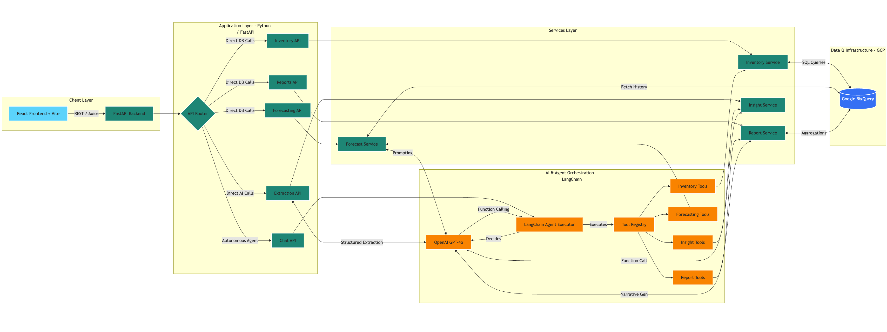

# AI-Powered-Retail-Analytics-Inventory-Agent
An autonomous AI agent platform built to modernize retail operations. By combining LangChain, OpenAI GPT-4o, and Google Cloud BigQuery, this system moves beyond traditional passive dashboards. It provides a natural language interface where retail managers can query inventory, generate AI-driven demand forecasts, extract structured data from raw emails, and generate full narrative reports—all through a single conversational interface.

- Python
* FastAPI
+ React
- GCP
* OpenAI

# 🌟 Key Highlights & Paradigm Shift
Traditional web apps require developers to hardcode UI filters and SQL queries for every possible question. This project uses an Agentic Architecture:
Multi-Step Autonomy: Ask "What items are out of stock, and what is the 14-day forecast for the worst one?" The AI agent decides on its own to query inventory, identify the worst item, and trigger a forecasting model—chaining 3 separate tools dynamically.
Schema-Free Ingestion: Paste a raw, unstructured email from a store manager. Using OpenAI's native Function Calling, the AI maps messy text into strict, database-ready JSON schemas with zero custom regex parsers.
Cognitive Synthesis: It doesn't just return JSON tables. It passes data through GPT-4o to generate executive summaries, explain why demand is spiking, and provide actionable recommendations.

# 🏗️ System Architecture

# 🛠️ Tech Stack
| Layer | Technology | Purpose |
| :--- | :--- | :--- |
| **Frontend** | React 19, Vite, Tailwind CSS, Recharts | Sub-second HMR, modern UI, data visualization |
| **Backend** | Python 3.11+, FastAPI, Pydantic v2 | High-performance async API, strict data validation |
| **AI Engine** | LangChain, OpenAI GPT-4o | Agent orchestration, Function Calling, forecasting |
| **Database** | GCP BigQuery | Petabyte-scale warehousing, partitioned by date |
| **Infrastructure** | Docker, GCP Cloud Run, Terraform | Serverless scaling, Infrastructure as Code (IaC) |

# ⚙️ Local Setup & Installation
Prerequisites
- Python 3.11+ (3.14 is not supported due to missing Rust binaries for Pydantic)
- Node.js v18+
- Google Cloud CLI (gcloud)
- An OpenAI API Key
- A GCP Project with Billing enabled

## 1. Clone & Configure
git clone https://github.com/Tej619/AI-Powered-Retail-Analytics-Inventory-Agent.git \
cd AI-Powered-Retail-Analytics-Inventory-Agent

## Create and activate Python environment
python3.11 -m venv venv \
source venv/bin/activate

## Install Python dependencies
pip install -r requirements.txt

## 2. Environment Variables
Copy .env.example to .env and fill in your credentials:

GCP_PROJECT_ID=your-gcp-project-id \
OPENAI_API_KEY=sk-your-openai-key \
GCP_BIGQUERY_DATASET=retail_analytics 

## 3. GCP Authentication
gcloud auth login \
gcloud auth application-default login \
gcloud config set project your-gcp-project-id \
gcloud services enable bigquery.googleapis.com 

## 4. Database Initialization
### Create BigQuery tables
python scripts/setup_bigquery.py

### Seed with 180 days of mock retail data
python scripts/seed_data.py

## 5. Run the Application
- Backend (Terminal 1):

uvicorn app.main:app --reload

- Frontend (Terminal 2):

cd frontend
npm install
npm run dev

# Author
Tejas Vaity

# Demo Video
https://github.com/user-attachments/assets/14538cdf-e738-4725-81d9-21907d19b774
